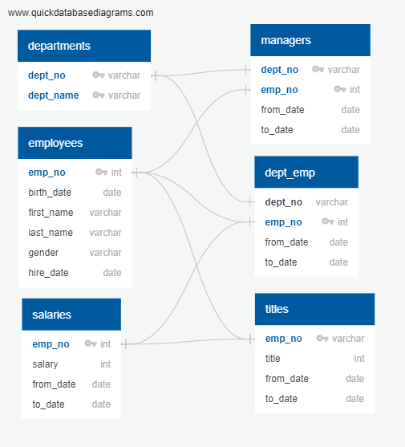
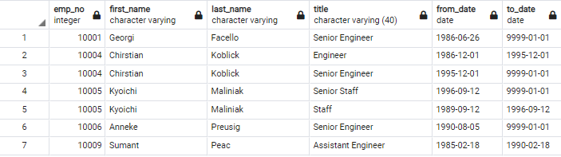
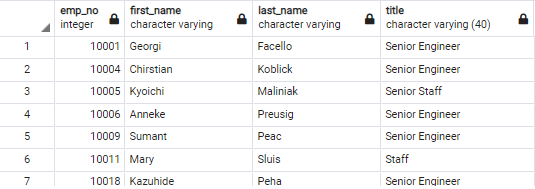
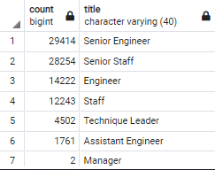
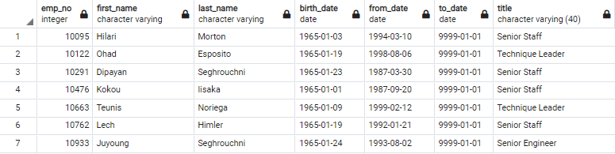

# Pewlett-Hackard-Analysis

## Overview of the Analysis

### In this assignment, I developed a program to determine the amount of people who may retire or should be asked to retire this year based off certain parameters given to me, such as date of birth. In this assignment, I used pgAdmin to manipulate and create universal csv (excel files) with all the information needed to make accurate retirement suggestions. With this challenge, there were many different spreadsheets with only a tiny bit of information in each one of them. To get a better scope of the project I was working on, I created an Employee Database which linked the similarities in each of the datasets. These results are shown below.

### Based off these common connections between the data sheets, it was clear that the datasets could be combined to help answer the retirement question within the company.

## Results

- In the first challenge to this problem set, I looked for employees in the company that were born between 1952 and 1955. I spliced the "Employees" and "Titles" tables together to form a retirement title table. The results of this table are shown below. 

- Unfortunately, this table is not perfect. In fact, we see that some of the same employees are repeated twice, when they should only be shown once. This might've happened because of a job title switch over the years. To combat this problem, I used the DISTINCT ON method to retrieve only one occurence of the employee number and took variation with the most recent job title date. The reults of this new edited version of the potential retiree candidates is shown below.

- The next step I took towards completing this assingment was determining the amount of people who would be retiring from each department. First, I ran a counter on the number of each title from the unique titles table. Then I spliced each title with the counter to create the retiring titles table shown below. This table shows the number of people from each job title due to retire soon. 

- Next, I created a table which found the number of employees eligible to work the mentorship program. I looked for employees who were born between January 1st 1965 and December 31st 1965 to fill the mentorship program. I combined the "Employees" and the "Department Employees" tables to create my "Mentorship Eligibity" table. The employees eligible for the mentorship program can be found in the table directly below.

## Summary of Project

